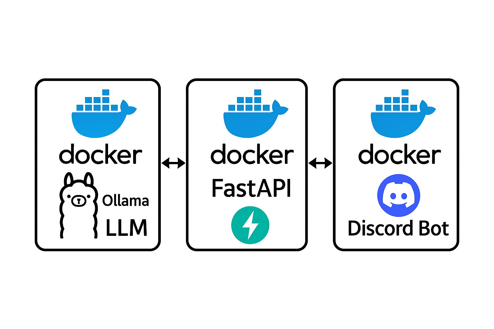

# bot_sample



- 봇 샘플 코드들입니다.
- 실제 배포중이라 service로직은 공개하지 않았습니다.
- Docker Compose를 통해 Bot <-> FastAPI <-> Ollama 모델간의 통신을 지원합니다.

### Contact
email : zebra0345@naver.com
관련 문의, 구조 질문 주시면 언제든 답변가능합니다.


## 프로젝트 구조 요약
```
📁 project-root/
├── 📁 Discord_bot/                 # 디스코드 봇 관련 코드
│   ├── main.py                    # 봇 실행 진입점
│   ├── bot.py                     # Discord Bot 설정 및 이벤트 처리
│   ├── utils.py                   # FastAPI 통신, 공통 유틸
│   ├── views.py                   # Discord UI 뷰 (Button 등)
│   ├── requirements.txt           # 디스코드 봇 의존성 목록
│   ├── 📁 service/                # 서비스 로직 분리 디렉토리
│   │   ├── playback.py           # 음악 재생 / 정지 / 스킵 등 제어
│   │   ├── message_embed.py      # embed 메시지 처리
│   │   ├── state.py              # 상태 관리 및 정리
│   │   └── infinite_mode.py?     # (선택) 무한모드 관련 로직 (분리 시)
│   ├── 📁 static/                 # 썸네일 등 정적 리소스 (선택)

├── 📁 FastAPI_server/             # FastAPI 백엔드 서버
│   ├── main.py                    # FastAPI 엔트리포인트
│   ├── api.py                     # API 엔드포인트 (예: /resolve)
│   ├── model_utils.py             # LLM 호출 및 응답 처리
│   ├── requirements.txt           # FastAPI 서버 의존성 목록
│   └── .env                       # 환경 변수 (예: LLM 주소 등)

├── 📁 llm_model/                  # Ollama 기반 LLM (Docker에서 직접 로드)
│   └── Docker로 관리됨           # 내부에 실제 코드 없음, Ollama 이미지 사용

├── docker-compose.yml             # 전체 서비스 Docker Compose 정의
├── .env                           # 공통 환경 변수 (FastAPI URL 등)
└── README.md                      # 프로젝트 설명 및 구조
```